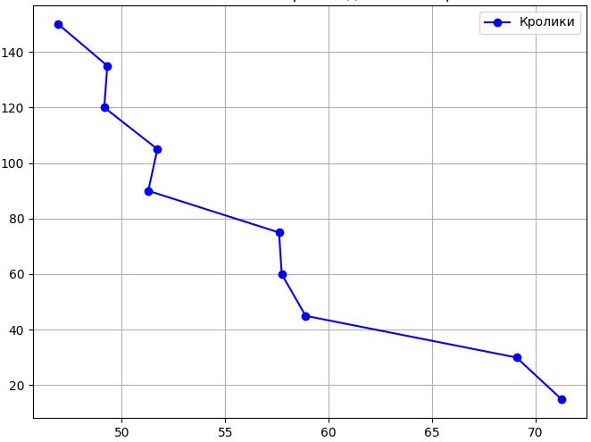
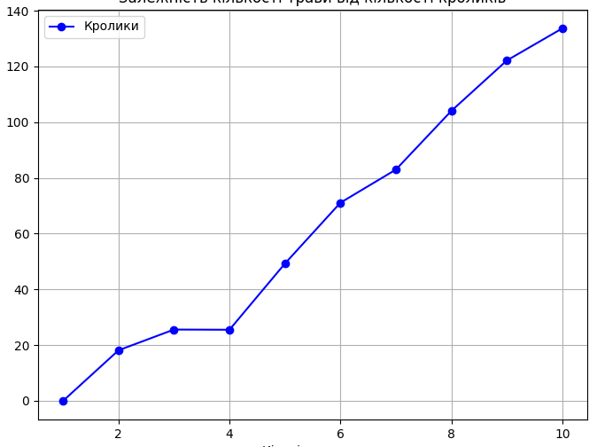
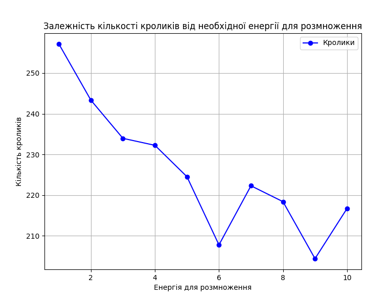

## Комп'ютерні системи імітаційного моделювання
## СПм-22-4, **Скиба Олександр Володимирович**
### Лабораторна робота №**1**. Опис імітаційних моделей та проведення обчислювальних експериментів

 

### Варіант 6, модель у середовищі NetLogo:
[Rabbits Grass Weeds](http://www.netlogoweb.org/launch#http://www.netlogoweb.org/assets/modelslib/Sample%20Models/Biology/Rabbits%20Grass%20Weeds.nlogo)

 

### Вербальний опис моделі:
Симуляція поведінки зайців в їхньому природному середовищі. Коженому зайцю в моделі призначено роль агента, який діє відповідно до певного набору правил. За такими правилами зайці ведуть себе наступним чином: якщо поблизу виявляється інший заєць, то вони зменшують свою швидкість руху (збільшують обережність), а коли на шляху немає перешкод у вигляді інших зайців, вони можуть прискорити свій рух (поширюються на більшу територію).

Модель дозволяє вивчати, як змінюється поведінка та розподіл зайців у природному середовищі, враховуючи їхню конкуренцію за ресурси та можливість утворення груп при наближенні одного зайця до іншого. Ця модель може служити для дослідження динаміки популяцій зайців та їхньої взаємодії в екологічних системах.

### Керуючі параметри:
- **number** визначає початкову кількість зайців у середовищі моделювання.
- **birth-threshold** визначає кількість енергії, яку має накопичити заяць перед тим, як він може розмножитися.
- **grass-grow-rate** визначає темп росту трави в віртуальному середовищі, впливаючи на доступність їжі для зайців.
- **grass-energy** вказує, скільки енергії може надати спожита трава зайцям, коли вони її їдять.
- **weeds-grow-rate** визначає темп росту сорняків, які конкурують з травою за ресурси та можуть обмежувати її ріст.
- **weed-energy** вказує, скільки енергії може отримати заяць, споживаючи сорняки.

### Внутрішні параметри:
- **energy**. рандомне значення стартової енергії зайців.

### Показники роботи системи:
- кількість зайців на поточному такті симуляції.
- кількість трави на поточному такті симуляції.
- кількість сорняків на поточному такті симуляції.

### Примітки:
Кролики конкурують за доступ до трави, а також змагаються за простір із бур'янами. Модель показує, як конкуренція за ресурси може впливати на чисельність популяцій.

### Недоліки моделі:
Модель не враховує безліч факторів, які можуть впливати на екосистему, такі як клімат, хижаки, конкуренція та ін.

 

## Обчислювальні експерименти
### 1. Вплив кількості кроликів на середню кількість трави
Досліджується залежність кількість трави протягом певної кількості тактів (100) від кількості кроликів, зазначеного на початку симуляції.
Експерименти проводяться при 15-150 кроликах, з кроком 15, усього 10 симуляцій.  
Інші керуючі параметри мають значення за замовчуванням:
- **birth-threshold**: 15
- **grass-grow-rate**: 5
- **grass-energy**: 5
- **weeds-grow-rate**: 0
- **weed-energy**: 0

<table>
<thead>
<tr><th>Кількість кроликів</th><th>Середня кількість трави</th></tr>
</thead>
<tbody>
<tr><td>15</td><td>71.2475</td></tr>
<tr><td>30</td><td>69.0775</td></tr>
<tr><td>45</td><td>58.8825</td></tr>
<tr><td>60</td><td>57.73</td></tr>
<tr><td>75</td><td>57.6</td></tr>
<tr><td>90</td><td>51.2775</td></tr>
<tr><td>105</td><td>51.72</td></tr>
<tr><td>120</td><td>49.15</td></tr>
<tr><td>135</td><td>49.3</td></tr>
<tr><td>150</td><td>46.925</td></tr>
</tbody>
</table>

Графік наочно показує, що збiльшення кроликів в 10 разiв, зменшує клькiсть трави леше на 15 ед.

### 2. Вплив росту трави на середню кількість кроликів
Досліджується залежність кількостi кроликів протягом певної кількості тактів (100) від росту трави, зазначеного на початку симуляції.
Експерименти проводяться при 1 росту трави, з кроком 1, усього 10 симуляцій.  
Інші керуючі параметри мають значення за замовчуванням:
- **numer**: 150
- **birth-threshold**: 15
- **grass-energy**: 5
- **weeds-grow-rate**: 0
- **weed-energy**: 0

<table>
<thead>
<tr><th>Рост трави</th><th>Кількість кроликів</th></tr>
</thead>
<tbody>
<tr><td>1</td><td>0</td></tr>
<tr><td>2</td><td>18.16</td></tr>
<tr><td>3</td><td>25.6</td></tr>
<tr><td>4</td><td>25.53</td></tr>
<tr><td>5</td><td>49.28</td></tr>
<tr><td>6</td><td>71.11</td></tr>
<tr><td>7</td><td>83</td></tr>
<tr><td>8</td><td>104.07</td></tr>
<tr><td>9</td><td>122.16</td></tr>
<tr><td>10</td><td>133.68</td></tr>
</tbody>
</table>

Графік наочно показує, що для 150 кроликiв недостатьньо темп роста трави < 10, так як в результатi середня кiлькiсть меньше нiж початкова.

### 3. Вплив кількість енергії для розмноження на середню кількість кроликів
Досліджується залежність кількостi кроликів протягом певної кількості тактів (100) від необхiдної енергії на розмноження, зазначеного на початку симуляції.
Експерименти проводяться при 1 необхiдной енергiї, з кроком 1, усього 10 симуляцій.  
Інші керуючі параметри мають значення за замовчуванням:
- **numer**: 150
- **grass-grow-rate**: 5
- **grass-energy**: 5
- **weeds-grow-rate**: 0
- **weed-energy**: 0

<table>
<thead>
<tr><th>Необхидна ерегiя</th><th>Кількість кроликів</th></tr>
</thead>
<tbody>
<tr><td>1</td><td>257.16</td></tr>
<tr><td>2</td><td>243.34</td></tr>
<tr><td>3</td><td>233.96</td></tr>
<tr><td>4</td><td>232.24</td></tr>
<tr><td>5</td><td>224.53</td></tr>
<tr><td>6</td><td>207.76</td></tr>
<tr><td>7</td><td>222.29</td></tr>
<tr><td>8</td><td>218.39</td></tr>
<tr><td>9</td><td>204.38</td></tr>
<tr><td>10</td><td>216.7</td></tr>
</tbody>
</table>

Графік наочно показує, що чим меньше енергiї потрiбно на розмноження, тим бiльша середня кiлькiсть
кроликiв за 100 тактiв, но як видно iз експерименту не завжди це так 
